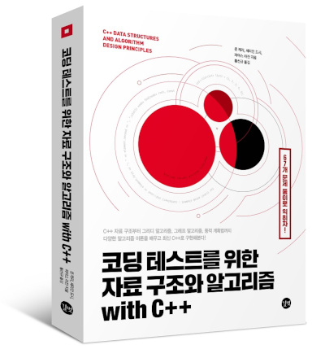

# 『코딩 테스트를 위한 자료 구조와 알고리즘 with C++』

### 『코딩 테스트를 위한 자료 구조와 알고리즘 with C++』(길벗, 2020) 도서의 예제 소스 파일입니다.

* 책의 모든 예제 코드는 Visual Studio 2019, C++ 14 버전에서 테스트했습니다.
* 각 장의 연습 문제는 Exercise1, Exercise2 …처럼 하위 폴더로 구분되어 있습니다.
* 각 장의 실습 문제는 Activity1, Activity2 …처럼 하위 폴더로 구분되어 있습니다.
* OpenSSL과 boost 라이브러리를 설치해야 실습할 수 있는 코드들이 있습니다.
* 4장의 예제 코드 빌드 방법은 Lesson4의 README.md를 참고하세요.

- 자세한 책 소개 및 구매: [예스24](https://bit.ly/37ojBTm), [교보문고](https://bit.ly/3qhbsbJ), [인터파크](https://bit.ly/36pyCoB), [알라딘](https://bit.ly/3o8onuU)

### 목차

1. 리스트, 스택, 큐
2. 트리, 힙, 그래프
3. 해시 테이블과 블룸 필터
4. 분할 정복
5. 그리디 알고리즘
6. 그래프 알고리즘 I
7. 그래프 알고리즘 II
8. 동적 계획법 I
9. 동적 계획법 II
A. 실습 문제 풀이

### Visual Studio 2019 프로젝트

* vs2019 폴더에는 예제 소스 코드와 Visual Studio 2019 프로젝트 & 솔루션 파일을 함께 제공합니다.

### boost 라이브러리
* Windows: https://www.boost.org/doc/libs/1_71_0/more/getting_started/windows.html
* Linux/macOS: https://www.boost.org/doc/libs/1_71_0/more/getting_started/unix-variants.html

### OpenSSL 라이브러리
* Windows: https://slproweb.com/products/Win32OpenSSL.html
* Linux/macOS: https://www.openssl.org
